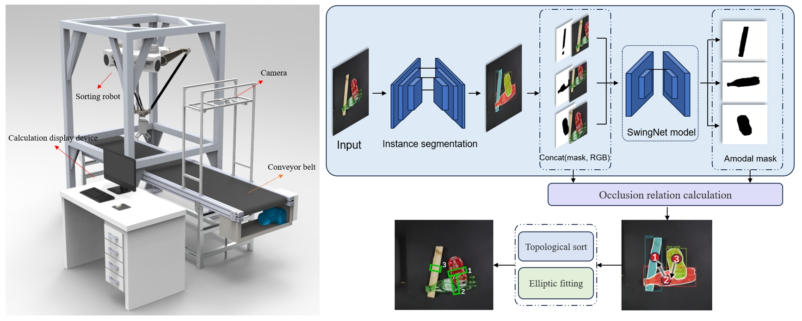
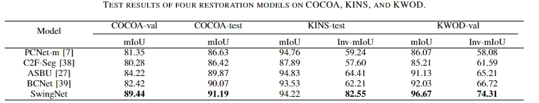
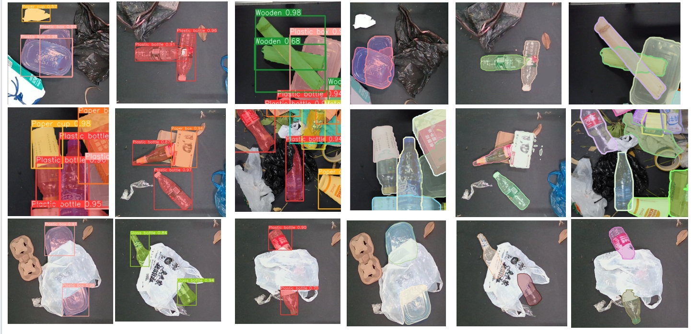

#  OSRNet: Occlusion Recovery and Relationship Detection of Irregular-shaped Objects [PyTorch]


Qiaokang Liang, Xiangyu Zhang† and Hai Qin

*School of Electrical and Information Engineering, Hunan University, Changsha, China.*

† Corresponding author


⭐ If OSRNet is helpful to you, please star this repo. Thanks! 

## 📝 Abstract

Existing computer vision systems have surpassed human capabilities in understanding the visible parts of objects, but there is still a gap in accurately describing the occluded parts of objects. This is particularly evident in the case of occlusion between irregular objects in practical solid waste sorting scenarios, such as robotic waste classification. This paper proposes a two-stage convolutional neural network-based solution for occluded object understanding and reconstruction, introducing the Occlusion Segmentation-Recovery Network (OSRNet). Firstly, we create the first-ever kitchen waste occlusion object dataset (KWOD), addressing the lack of datasets for occlusion-related research in previous works. Secondly, the OSRNet model is trained in two stages: the first stage trains a representative instance segmentation model to obtain the category, position, and visible parts of the occluded objects; in the second stage, we design the Swing convolutional Net (SwingNet) to reconstruct the visible portions of occluded objects into their visually complete forms. The two-stage outputs enable the sorting robot to accurately grasp occluded irregular objects. Experimental results on public datasets COCOA, KINS, and our KWOD dataset show that our model achieves mIOU scores of 91.19\%, 82.55\%, and 96.67\%, respectively, for the completion of occluded objects, outperforming existing methods and demonstrating the advanced and generalized capability of our approach. Code is available at https://github.com/yulle13/OSRNet.

##  Overview



## ⚙ Environment

```shell
torch==2.2.0 
numpy==1.24.4
opencv-python==4.2.0
scikit-image==0.21.0
ultralytics==8.1.45
```


## 🔥 Train

Download the dataset of [Kitchen Waste Occlusion Object Dataset](https://drive.google.com/drive/folders/1mb_-gWHZHz_pGyHjbB6eW05IhS5xPD9Y) and put the `KWOD` directory (containing 2117 `.jpg` image files) into `./data`, then run the following command:

```
python main.py
```

The log and model files will be in `./output` and `./output/result`, respectively.


## ⚡ Demo

Run the following command:

```shell
python demo/produce_grasp.py
```

The test sets are in `./data`.


## Results





